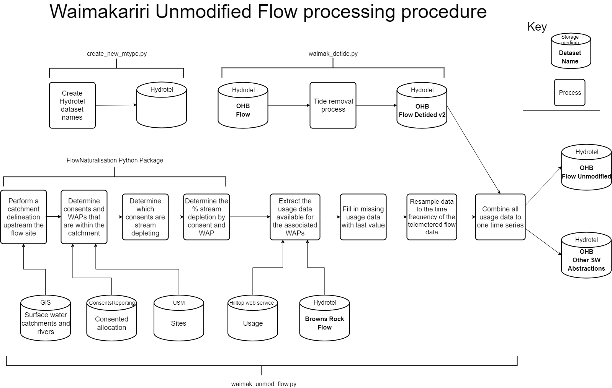

Remove the tidal effect on the Waimak SH1 water levels
=================================================================

This git repository contains code necessary to create a flow time series in Hydrotel for lowflow restrictions at the Old Highway Bridge on the mouth of the Waimakariri River.

There are four main procedures:
  - Create the appropriate dataset names in Hydrotel (i.e. create the object and point numbers)
  - Remove the tides from the monitored flow (detided flow)
  - Extract the abstractions and add them back to the detided flow (unmodified flow)
  - Assign the unmodified flow Hydrotel name to the appropriate lowflow band(s)

The first three procedures are laid out in the below figure:

Each of these three procedures are represented at three python scripts. The first procedure only needs to be run once per Hydrotel installation. Once the datasets have been created, the appropriate fields need to be populated in the parameters.yml file (e.g. detided_mtype, unmod_mtype, other_mtype, detided_point, unmod_point, other_point). 

Run Frequency
-------------
Once a day at 13:50
